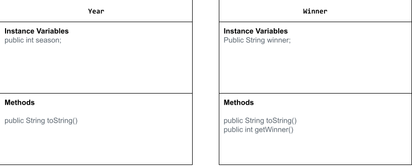

# Data-for-Social-Good-Project
# Unit 3 - Data for Social Good Project 

## Introduction 

Software engineers develop programs to work with data and provide information to a user. Each user has different needs based on the information they are looking for from data. Your goal is to create a data analysis program for your user that stores and analyzes data to provide the information they need. 

## Requirements 

Use your knowledge of object-oriented programming, one-dimensional (1D) arrays, and algorithms to create your data analysis program: 
- **Write a class** – Write a class to represent your user or business and store and analyze their data with no-argument and parameterized constructors. 
- **Create at least two 1D arrays** – Create at least two 1D arrays to store the data that your user needs information about. 
- **Write a method** – Write a method that finds or manipulates the elements in a 1D array to provide the information your user needs. 
- **Implement a toString() method** – Write a toString() method that returns general information about the data (for example, number of values in the dataset). 
- **Document your code** – Use comments to explain the purpose of the methods and code segments and note any preconditions and postconditions. 

## User Story 

> As a soccer analyst,   
> I want to document every win of the Champions League ,   
> so that I can educate new genertions of fans. 

## Dataset  

Dataset: https://www.kaggle.com/datasets/thesardauna/uefa-champions-league-data-19552021
- **Winner** (String) - name of the club that won 
- **Year** (int) - year of the chamions league

## UML Diagram 

 

## Description 

Our code prints out every Chamions League winner and the year they won it. Then the user enters a number 1-45 and it prints who won the 1st - 45th Champions League. Then the user can input y or n to continue searching and if they put a number over 45 then our if statement prints invalid option please select a valid number 1-45.